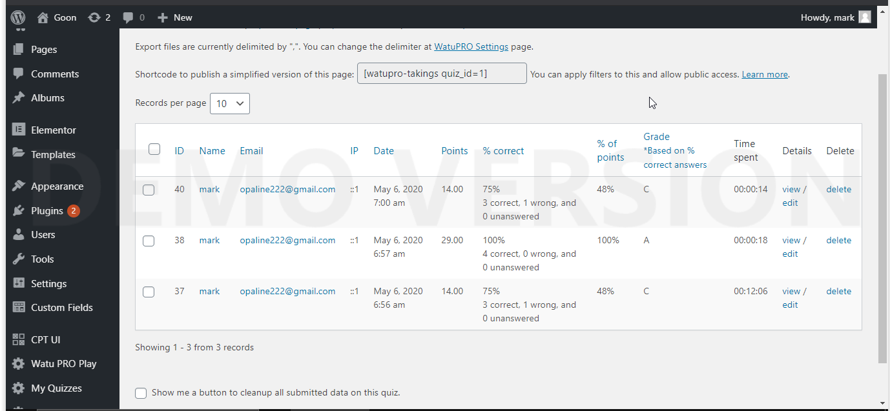

# Customized WatuPro quiz plugin in Wordpress to automate the new grades upon question/answer changes

In 2020, I was blessed to land an opportunity to customize a WordPress plugin! The client was outstanding. The task was to alter the default functionality of the WatuPro quiz plugin. The default functionality of the WatuPro Quiz plugin does not change the grades if the answers of the questions change, and understandably the client wanted this to happen, to automate the process for him in one fell swoop, rather than the time-sucking drudgery of doing this one-by-one. The use case was calling for another solution.

Fortunately, the WatuPro plugin offered plenty of hooks inside of their plugin in anticipation for anyone extending their plugin for extra functionality, and mine was in the hook named 'wp-saved-question'.

Anytime a user saved the Edit Question page in the admin (with the answers), the changes reflected in the grading system and the occurences of the tests that were already taken with the new grades, accounting for the new answers.

For a fantasy football environment :) this was very ideal!

I upgraded my laptop from below i3 to i5 in 2020, so I was able to use Microsoft Visual Studio Code to it's most fullest extent, and had extensive experience with the "Debugging Console" in the bottom, so I could have my plugin replicate a lot of the original functionality, and see what was being passed in the functions in a regular pass, and the structure of data inside of them. This was the most I was immersed in the "Debugging Console" because the other times it was too slow on a slower laptop to get much out of it, but here I managed to grasp it and work in a faster speed then was anticipated by the Client (1.5 days!). To reverse engineer this bulky plugin, the Call Stack in the breakpoint indicated the flow in which to discover the sequence, especially conditional breakpoints for CRUD Database operations.

A "question" data structure had to have a dictionary/array item of answers to calculate the score, which would have been very difficult to find without a debugging console. The last two items of code demonstrate the discovery to calculate the grade in the native way that the plugin does it rather than implementing this function all by myself.

```php
//Iterate through all student taking IDS, then iterate through the questions to calculate totals
foreach ($takings as $taking)
{
	$taking_id = $taking->ID;
	$total = $score = $max_points = $achieved = $num_empty = $num_wrong = 0;
	//Iterate through the questions to calculate totals
	foreach ($questions as $question) {
		$question_id = $question->ID;
		//According to the store_result function in the watopro.php lib file, a $question object is a database row.
		$answers = $wpdb->get_results($wpdb->prepare("SELECT * FROM ".WATUPRO_ANSWERS." WHERE question_id=%d AND question_id>0 ORDER BY sort_order", $question_id));
		//this part is necessary for the WTPQuestion::max_scores function. It's looking at this q_answers variable I just put below
		$question->q_answers = $answers;

```

I was legit blessed for the client in 2020, and he said:

> Mark was absolutely outstanding for the entirety of the project. He worked quickly, communicated often, and executed the job tasks perfectly. I could not be more pleased with Mark! I would highly recommend him to others.

I got 5 stars and he did too. I said in return:

> I want to thank Jim Atkinson for this amazing fun opportunity! Everything was completely straightforward, clearly laid out, and he gave me all the space & leeway to get everything done. I lucked out with my last 3. I worked with some new software in the course of this, it was pretty cool. If you are considering a contract with Jim, please do it with confidence & zero trepidation.

So Cisco/Juniper/Cloud Network Automation peeps, I can bring this to you!

There is a demonstration of how this plugin works to underscore the point.

You change what the correct answer is in the question part of the plugin. As soon as the question is saved, the grades of the test, which is ideal for his use case. Really cool trick by automation. If I change the answer of one question, everything should reverse, and it did in these two images.




The first part of the project updated the grades for the tests, and the second part updated the grades/point for the answer the student gave for each exam. I'll put up the second phase of the project on the README.md, but please see the whole source code at watupro.php for what I did. The code I added is in the bottom of the default watupro.php file!

```php
////////////////////
//
//  SECOND TWEAK (UPDATE THE OTHER TABLE AS WELL, WHICH IS THE WP_WATUPRO_STUDENT_PLUGIN APP. THE REASON FOR THIS IS TO UPDATE THE SINGLE PAGE VIEW OF THE EXAM TAKEN OCCURENCES, AS IT READS FROM THAT TABLE!!!
//
////////////////////
$student_answers = $wpdb->get_results($wpdb->prepare("SELECT * FROM ".WATUPRO_STUDENT_ANSWERS." WHERE exam_id=%d ORDER BY ID DESC ",$exam_id));
foreach ($student_answers as $key => $student_answer) {
	$student_answer_question_id = $student_answer->question_id;
    $answers = $wpdb->get_results($wpdb->prepare("SELECT * FROM ".WATUPRO_ANSWERS. " WHERE question_id=%d  AND question_id>0 ORDER BY sort_order",$student_answer_question_id));
    $question = $wpdb->get_row($wpdb->prepare("SELECT * FROM ".WATUPRO_QUESTIONS. " WHERE ID=%d",$student_answer_question_id));
    $question->q_answers = $answers;
    $answers_values = array_map(function($answer){return $answer->answer;},$answers);
	$answers_quotes = array_map(function($answer_value){return '"'. $answer_value . '"';},$answers_values);
	$chosen_answer_ids = array();
	$chosen_answer_full_names = $student_answer->answer;
	$chosen_answer_full_names = str_replace($answers_values,$answers_quotes,$chosen_answer_full_names);
	foreach(str_getcsv($chosen_answer_full_names) as $chosen_answer_full_name)
	{
		$chosen_answer_full_name = trim($chosen_answer_full_name);
		foreach ($answers as $answer) {
			if(strtolower($chosen_answer_full_name) == strtolower($answer->answer))
			{
				$chosen_answer_ids[] = $answer->ID;
			}
		}
	}
	list($points, $correct, $is_empty) = WTPQuestion::calc_answer($question, $chosen_answer_ids,$answers);
	if($debug)
	{
		echo "-------\n";
		echo "POINTS: $points\n";
		echo "CORRECT: $correct\n";
		echo "IS EMPTY: $is_empty\n";
	}
	$result = $wpdb->update(WATUPRO_STUDENT_ANSWERS, array(
	    	"points" => $points,
			"is_correct" => $correct,
	    ),
		array(
			"ID"=>$student_answer->ID
		)
	);
	echo $result;
}
////////////////////
//
//  END CHANGING THE SINGLE VIEW SECTION IN THE WP_WATUPRO_STUDENT_PLUGIN
//
////////////////////
```
